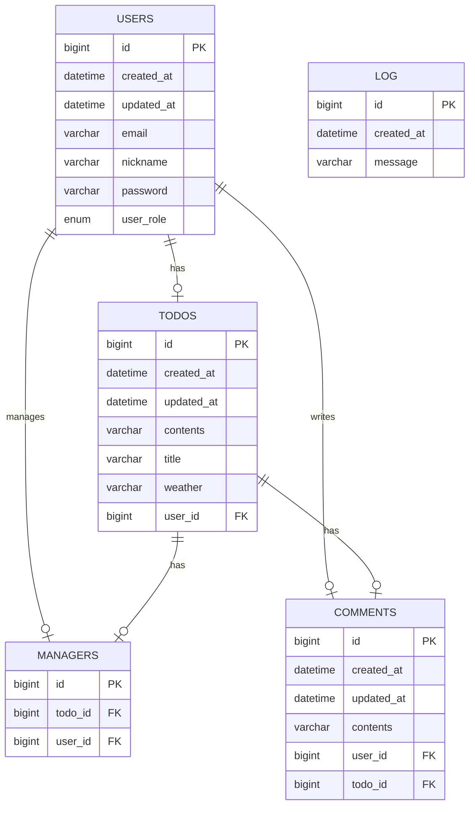

# 🗓️ Developing a Todo Application Using Spring Boot

## 💻 Introduction
- This project is an assignment designed to evaluate students' understanding of the online lecture.
- The application is developed as a personal project.
- The application is designed with a console-based user interface.

## 📆 Development Period
- **Study**: 14/01/2025 – 27/01/2025
- **Development**: 14/01/2025 – 27/01/2025

## 🛠️ Tech Stack
- Java 17
- Spring Boot 3.4.0
- Spring Data JPA
- MySQL Driver
- BCrypt 0.10.2
- MySQL 9.1.0
- Lombok
- JJWT 0.11.5
- Spring Security
- QueryDSL 5.0.0

## 🔗 ERD


## 📜 API Specification
### Basic Information
- Base URL (users): /users
- Base URL (todos): /todos
- Base URL (managers): /managers
- Base URL (comments): /comments
- Response Format: JSON
- Character Encoding: UTF-8

### API List
#### API Endpoints - User
| Method | URI                   | Description        | Request Body                             | Request Parameters | Path Variables | Response Code |
|--------|-----------------------|--------------------|------------------------------------------|--------------------|----------------|---------------|
| POST   | /auth/sign-up         | Sign up user       | `email` `password` `userRole` `nickname` |                    |                | 201           |
| POST   | /auth/sign-in         | Sign in user       | `email` `password`                       |                    |                | 200           |
| GET    | /users/{userId}       | Read specific user |                                          |                    | `userId`       | 200           |
| PUT    | /users                | Update password    | `oldPassword` `newPassword`              |                    |                | 200           | 
| PATCH  | /admin/users/{userId} | Update user role   | `userRole`                               |                    | `userId`       | 200           |

#### API Endpoints - Todo
| Method | URI         | Description        | Request Body            | Request Parameters | Path Variables | Response Code |
|--------|-------------|--------------------|-------------------------|--------------------|----------------|---------------|
| POST   | /plans      | Create plan        | `title` `task` `userId` |                    |                | 201           |
| GET    | /plans      | Read all plans     |                         | `page` `size`      |                | 200           |
| GET    | /plans/{id} | Read specific plan |                         |                    | `id`           | 200           |
| PATCH  | /plans/{id} | Update plan        | `title` `task`          |                    | `id`           | 200           |
| DELETE | /plans/{id} | Delete plan        |                         |                    | `id`           | 200           |

#### API Endpoints - Manager
| Method | URI            | Description            | Request Body       | Request Parameters | Path Variables | Response Code |
|--------|----------------|------------------------|--------------------|--------------------|----------------|---------------|
| POST   | /comments      | Create comments        | `content` `planId` |                    |                | 201           |
| GET    | /comments      | Read all comments      |                    |                    |                | 200           |
| GET    | /comments/{id} | Read specific comments |                    |                    | `id`           | 200           |
| PATCH  | /comments/{id} | Update comments        | `content`          |                    | `id`           | 200           |
| DELETE | /comments/{id} | Delete comments        |                    |                    | `id`           | 200           |

#### API Endpoints - Comment
| Method | URI            | Description            | Request Body       | Request Parameters | Path Variables | Response Code |
|--------|----------------|------------------------|--------------------|--------------------|----------------|---------------|
| POST   | /comments      | Create comments        | `content` `planId` |                    |                | 201           |
| GET    | /comments      | Read all comments      |                    |                    |                | 200           |
| GET    | /comments/{id} | Read specific comments |                    |                    | `id`           | 200           |
| PATCH  | /comments/{id} | Update comments        | `content`          |                    | `id`           | 200           |
| DELETE | /comments/{id} | Delete comments        |                    |                    | `id`           | 200           |

### API Details
#### Request Body Details - User
1. **`POST` Create(Sign up) User**
    ```json
    {
        "email" : "사용자 이메일",
        "password" : "사용자 비밀번호",
        "userRole" : "ADMIN 또는 USER"
    }
    ```

2. **`POST` Create(Sign in) User**
    ```json
    {
        "email" : "사용자 이메일",
        "password" : "사용자 비밀번호"
    }
    ``` 

3. **`PUT` Update Password**
    ```json
    {
        "oldPassword" : "기존의 비밀번호",
        "newPassword" : "새로운 비밀번호"
    }
    ```

4. **`PATCH` Update User Role**
    ```json
    {
        "userRole" : "새로운 사용자 권한"
    }
    ```

#### Request Body Details - Plan
1. **`POST` Create Plan**
    ```json
    {
        "title" : "일정 제목",
        "task" : "일정 내용",
        "userId" : 1
    }
    ```

2. **`PATCH` Update Plan**
    ```json
    {
        "title" : "수정하려는 일정 제목",
        "task" : "수정하려는 일정 내용"
    }
    ```

#### Request Body Details - Comment
1. **`POST` Create Comment**
    ```json
    {
        "content" : "댓글 내용",
        "planId" : 1
    }
    ```

2. **`PATCH` Update Comment**
    ```json
    {
        "content" : "수정하려는 댓글 내용"
    }
    ```

#### Response Body Details - User
1. **`POST` Create(Sign up) User**
 ```json
 {
     "bearerToken" : "your.jwt.token"
 }
 ```

2. **`POST` Create(Sign in) User**
 ```json
 {
     "bearerToken" : "your.jwt.token"
 }
 ```

3. **`GET` Read Specific User**
    ```json
    {
        "id" : 1,
        "email" : "사용자 이메일"
    }
    ```

#### Response Body Details - Plan
1. **`CREATE` Create Plan**
    ```json
    {
        "id" : 1,
        "title" : "일정 제목",
        "task" : "일정 내용",
        "createdAt" : "2024-12-16 14:46:03",
        "updatedAt" : "2024-12-16 14:46:03",
        "member": {
            "id": 1,
            "username": "작성자 이름",
            "email": "작성자 이메일"
        }
    }
    ```

2. **`GET` Read All Plans**
    ```json
    [
        {
            "title" : "일정1 제목",
            "task" : "일정1 내용",
            "createdAt" : "2024-12-17 14:00:00",
            "updatedAt" : "2024-12-17 15:00:00",
            "username": "일정1 작성자 이름",
            "totalComment": "일정1에 달린 댓글 총 개수"
        },
        {
            "title" : "일정2 제목",
            "task" : "일정2 내용",
            "createdAt" : "2024-12-16 10:20:00",
            "updatedAt" : "2024-12-16 10:20:30",
            "username": "일정2 작성자 이름",
            "totalComment": "일정2에 달린 댓글 총 개수 "
        },
        {
            "title" : "일정3 제목",
            "task" : "일정3 내용",
            "createdAt" : "2024-12-16 01:10:15",
            "updatedAt" : "2024-12-16 01:10:15",
            "username": "일정3 작성자 이름",
            "totalComment": "일정3에 달린 댓글 총 개수"
        }   
    ]
    ```

3. **`GET` Read Specific Plan**
    ```json
    {
        "id" : 1,
        "title" : "일정 제목",
        "task" : "일정 내용",
        "createdAt" : "2024-12-16 14:45:00",
        "updatedAt" : "2024-12-16 14:45:00",
        "member": {
            "id": 1,
            "username": "일정 작성자 이름",
            "email": "일정 작성자 이메일"
        }
    }
    ```

4. **`PATCH` Update Plan**
    ```json
    {
        "id" : 1,
        "title" : "수정된 일정 제목",
        "task" : "수정된 일정 내용",
        "createdAt" : "2024-12-16 14:46:04",
        "updatedAt" : "2024-12-16 15:03:31",
        "member": {
            "id": 1,
            "username": "일정 작성자 이름",
            "email": "일정 작성자 이메일"
        }
    }
    ``` 

#### Response Body Details - Comment
1. **`CREATE` Create Comment**
```json
{
    "id": 1,
    "content": "댓글 내용",
    "plan": {
        "id": 1,
        "title": "일정 제목",
        "task": "일정 내용",
        "createdAt": "2024-12-19 09:34:25",
        "updatedAt": "2024-12-19 09:36:56",
        "member": {
            "id": 1,
            "username": "사용자 이름",
            "email": "사용자 이메일"
        }
    }
}
```

2. **`GET` Read all Comments**
```json
[
    {
        "id": 1,
        "content": "댓글1 내용",
        "plan": {
            "id": 1,
            "title": "댓글1이 달린 일정1의 제목",
            "task": "댓글1이 달린 일정1의 내용",
            "createdAt": "2024-12-19 10:34:25",
            "updatedAt": "2024-12-19 10:36:56",
            "member": {
                "id": 1,
                "username": "일정1 작성자의 이름",
                "email": "일정1 작성자의 이메일"
            }
        }
    },
    {
        "id": 2,
        "content": "댓글2 내용",
        "plan": {
            "id": 2,
            "title": "댓글2가 달린 일정2의 제목",
            "task": "댓글2가 달린 일정2의 내용",
            "createdAt": "2024-12-19 09:00:00",
            "updatedAt": "2024-12-19 10:05:00",
            "member": {
                "id": 2,
                "username": "일정2 작성자의 이름",
                "email": "일정2 작성자의 이름"
            }
        }
    }
]
```

3. **`GET` Read specific Comment**
```json
{
    "id": 1,
    "content": "댓글1 내용",
    "plan": {
        "id": 3,
        "title": "댓글1이 달린 일정3의 제목",
        "task": "댓글1이 달린 일정3의 내용",
        "createdAt": "2024-12-19 09:48:51",
        "updatedAt": "2024-12-19 09:48:51",
        "member": {
            "id": 1,
            "username": "일정3 작성자의 이름",
            "email": "일정3 작성자의 이메일"
        }
    }
}
```

4. **`PATCH` Update Comment**
```json
{
    "id": 1,
    "content": "수정한 댓글1의 내용",
    "plan": {
        "id": 1,
        "title": "댓글1이 달린 일정1의 제목",
        "task": " ",
        "createdAt": "2024-12-19 09:34:25",
        "updatedAt": "2024-12-19 09:36:56",
        "member": {
            "id": 1,
            "username": "일정1 작성자의 이름",
            "email": "일정1 작성자의 이메일"
        }
    }
}
```

### Error Response Code
#### Description
| HTTP Status | Description           | When Returned                                                                                      |
|-------------|-----------------------|----------------------------------------------------------------------------------------------------|
| 400         | Bad Request           | Required fields are missing <br/> The length or format is incorrect <br/> Value `null` is provided |
| 401         | Unauthorized          | Authentication fails <br/> User is not signed in                                                   |
| 404         | Not Found             | Resource cannot be found                                                                           |
| 500         | Internal Server Error | A server error occurs                                                                              |


#### Examples
| HTTP Status | Message Example                                                                                                                                                                                                    |
|-------------|--------------------------------------------------------------------------------------------------------------------------------------------------------------------------------------------------------------------|
| 400         | "**<필드 이름(영어)>** 필드에서 오류가 발생했습니다. **<필드 이름(한글)>** 입력은 필수입니다." <br/> "길이가 2에서 20 사이여야 합니다." <br/> "이메일 형식이 틀렸습니다. 다시 입력해 주세요." <br/> "변경을 원하시지 않으면 가입 시 입력한 값을 입력해 주세요." <br/> "null과 빈값을 허용하지 않습니다. 공백으로 입력해 주세요." |
| 401         | "로그인 해주세요." <br/> "비밀번호가 일치하지 않습니다." <br/> "이메일이 일치하지 않습니다."                                                                                                                                                       |
| 404         | "입력된 id가 존재하지 않습니다. 다시 입력해 주세요." <br/> "이미 삭제되었거나 존재하지 않는 id입니다."                                                                                                                                                  |
| 500         | "오류가 발생했습니다."                                                                                                                                                                                                      |

### Request Body Description
#### Field Information - User
| Field Name | Data Type     | Mandatory Status | Description                                                                                               |
|------------|---------------|------------------|-----------------------------------------------------------------------------------------------------------|
| id         | Long          | Optional         | Identifier for each user  <br/> Required for **GET** or **PATCH** requests                                |
| nickname   | String        | Mandatory        | User's nickname                                                                                           |
| email      | String        | Mandatory        | User's email address                                                                                      |
| password   | String        | Mandatory        | User's password                                                                                           |
| createdAt  | LocalDateTime | Not Included     | The timestamp when the user is created  <br/> Automatically stored in the database upon creation          |
| updatedAt  | LocalDateTime | Not Included     | The timestamp when the user is last updated  <br/> Automatically stored in the database upon modification |

#### Field Information - Plan
| Field Name | Data Type     | Mandatory Status | Description                                                                                                                          |
|------------|---------------|------------------|--------------------------------------------------------------------------------------------------------------------------------------|
| id         | Long          | Optional         | Identifier for each plan <br/> Required for **GET**, **PATCH**, or **DELETE** requests                                               |
| title      | String        | Mandatory        | Title of the plan <br/> Must be between 1 and 20 characters                                                                          |
| task       | String        | Optional         | Detailed description of the plan <br/> Must be less than 200 characters <br/> Should be an empty String(`""`) when the value is null |
| userId     | Long          | Mandatory        | Identifier of user <br/> Required for **CREATE** request                                                                             |
| createdAt  | LocalDateTime | Not Included     | The timestamp when the plan is created  <br/> Automatically stored in the database upon creation                                     |
| updatedAt  | LocalDateTime | Not Included     | The timestamp when the plan is last updated  <br/> Automatically stored in the database upon modification                            |
| isDeleted  | Boolean       | Not Included     | Deletion status of the plan  <br/> Automatically stored in the database upon deletion                                                |
| deletedAt  | LocalDateTime | Not Included     | The timestamp when the plan is deleted  <br/> Automatically stored in the database upon deletion                                     |

#### Field Information - Comment
| Field Name | Data Type     | Mandatory Status | Description                                                                                                   |
|------------|---------------|------------------|---------------------------------------------------------------------------------------------------------------|
| id         | Long          | Optional         | Identifier for each comments <br/> Required for **GET**, **PATCH**, or **DELETE** requests                    |
| content    | String        | Mandatory        | Content of comments <br/> Must be less than 200 characters                                                    |
| planId     | Long          | Mandatory        | Identifier of plan <br/> Required for **CREATE** request                                                      |
| createdAt  | LocalDateTime | Not Included     | The timestamp when the comments is created  <br/> Automatically stored in the database upon creation          |
| updatedAt  | LocalDateTime | Not Included     | The timestamp when the comments is last updated  <br/> Automatically stored in the database upon modification |
| isDeleted  | Boolean       | Not Included     | Deletion status of the comments <br/> Automatically stored in the database upon deletion                      |
| deletedAt  | LocalDateTime | Not Included     | The timestamp when the comments is deleted <br/> Automatically stored in the database upon deletion           |

## 📊 Database Schema
### 1. USER
```sql
CREATE TABLE users
(
   id         BIGINT AUTO_INCREMENT
        PRIMARY KEY COMMENT '사용자 식별자',
   email      VARCHAR(255)           NULL COMMENT '사용자 이메일',
   nickname   VARCHAR(255)           NULL COMMENT '사용자 닉네임',
   password   VARCHAR(255)           NULL COMMENT '사용자 비밀번호',
   user_role  ENUM ('ADMIN', 'USER') NULL COMMENT '사용자 권한',
   created_at DATETIME(6)            NULL COMMENT '생성일',
   updated_at DATETIME(6)            NULL COMMENT '수정일',
   CONSTRAINT unique_email
      UNIQUE (email)
);
```

### 2. TODO
```sql
CREATE TABLE todos
(
   id         BIGINT AUTO_INCREMENT
        PRIMARY KEY COMMENT '할 일 식별자',
   user_id    BIGINT       NOT NULL COMMENT '사용자 식별자',
   title      VARCHAR(255) NULL COMMENT '할 일 제목',
   contents   VARCHAR(255) NULL COMMENT '할 일 내용',
   weather    VARCHAR(255) NULL COMMENT '날씨 정보',
   created_at DATETIME(6)  NULL COMMENT '생성일',
   updated_at DATETIME(6)  NULL COMMENT '수정일',
   CONSTRAINT FK_user_todo
      FOREIGN KEY (user_id) REFERENCES users (id)
);
```

### 3. MANAGER
```sql
CREATE TABLE managers
(
    id      BIGINT AUTO_INCREMENT
        PRIMARY KEY COMMENT '매니저 식별자',
    todo_id BIGINT NOT NULL COMMENT '할 일 식별자',
    user_id BIGINT NOT NULL COMMENT '사용자 식별자',
    CONSTRAINT FK_manager_todo
        FOREIGN KEY (todo_id) REFERENCES todos (id),
    CONSTRAINT FK_manager_user
        FOREIGN KEY (user_id) REFERENCES users (id)
);
```

### 4. COMMENT
```sql
CREATE TABLE comments
(
   id         BIGINT AUTO_INCREMENT
        PRIMARY KEY COMMENT '댓글 식별자',
   todo_id    BIGINT       NOT NULL COMMENT '할 일 식별자',
   user_id    BIGINT       NOT NULL COMMENT '사용자 식별자',
   contents   VARCHAR(255) NULL COMMENT '댓글 내용',
   created_at DATETIME(6)  NULL COMMENT '생성일',
   updated_at DATETIME(6)  NULL COMMENT '수정일',
   CONSTRAINT FK_comment_user
      FOREIGN KEY (user_id) REFERENCES users (id),
   CONSTRAINT FK_comment_todo
      FOREIGN KEY (todo_id) REFERENCES todos (id)
);
```

### 5. LOGS
```sql
CREATE TABLE logs
(
    id         BIGINT AUTO_INCREMENT
        PRIMARY KEY COMMENT '로그 식별자',
    message    VARCHAR(255) NOT NULL COMMENT '로그 메시지',
    created_at DATETIME(6) NULL COMMENT '생성일'
);
```

## 🚀 Key Features
- Implements CRUD functionality for `members`, `plans`, and `comments`.
- Stores data in an SQL database using JPA.
- Resolves name duplication issues by using the user’s unique identifier.
- Supports pagination: By default, 10 items per page for retrieving the plan list.
- Provides soft delete functionality for `members`, `plans`, and `comments`.
- Implements exception handling.
- Prevents duplicate sign-ups with the same email during registration.
- Encrypts passwords using BCrypt before storing them in the database.
- Implements login functionality by creating a login filter and registering configuration.

## 🔍 Characteristics
- Separates the 3-layer architecture and DTOs into different packages by URL

## 📜 More Information

- [Visit Development Journal](https://writingforever162.tistory.com)
- [Visit Troubleshooting Records](https://writingforever162.tistory.com/category/Troubleshooting%3A%20%EB%AC%B4%EC%97%87%EC%9D%B4%20%EB%AC%B8%EC%A0%9C%EC%98%80%EB%8A%94%EA%B0%80%3F)