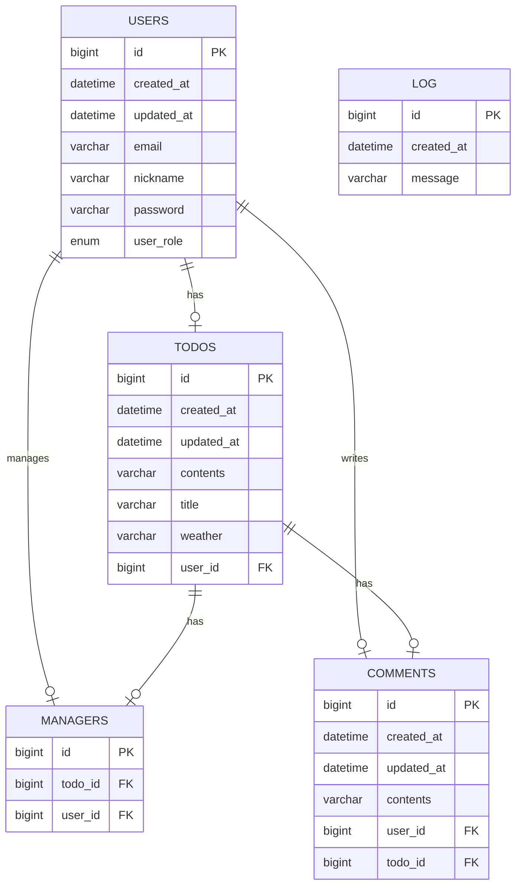

# 🗓️ Developing a Todo Application Using Spring Boot

## 💻 Introduction
- This project is an assignment designed to evaluate students' understanding of the online lecture.
- The application is developed as a personal project.
- The application is designed with a console-based user interface.

## 📆 Development Period
- **Study**: 14/01/2025 – 27/01/2025
- **Development**: 14/01/2025 – 27/01/2025

## 🛠️ Tech Stack
- Java 17
- Spring Boot 3.4.0
- Spring Data JPA
- MySQL Driver
- BCrypt 0.10.2
- MySQL 9.1.0
- Lombok
- JJWT 0.11.5
- Spring Security
- QueryDSL 5.0.0

## 🔗 ERD


## 📜 API Specification
### Basic Information
- Base URL (users): /users
- Base URL (todos): /todos
- Base URL (managers): /managers
- Base URL (comments): /comments
- Response Format: JSON
- Character Encoding: UTF-8

### API List
#### API Endpoints - User
| Method | URI                   | Description        | Request Body                             | Request Parameters | Path Variables | Response Code |
|--------|-----------------------|--------------------|------------------------------------------|--------------------|----------------|---------------|
| POST   | /auth/sign-up         | Sign up user       | `email` `password` `userRole` `nickname` |                    |                | 201           |
| POST   | /auth/sign-in         | Sign in user       | `email` `password`                       |                    |                | 200           |
| GET    | /users/{userId}       | Read specific user |                                          |                    | `userId`       | 200           |
| PUT    | /users                | Update password    | `oldPassword` `newPassword`              |                    |                | 200           | 
| PATCH  | /admin/users/{userId} | Update user role   | `userRole`                               |                    | `userId`       | 200           |

#### API Endpoints - Todo
| Method | URI             | Description                    | Request Body                           | Request Parameters                          | Path Variables | Response Code |
|--------|-----------------|--------------------------------|----------------------------------------|---------------------------------------------|----------------|---------------|
| POST   | /todos          | Create todo                    | `title` `contents`                     |                                             |                | 201           |
| GET    | /todos          | Read all todos                 |                                        | `page` `size` `weather` `startsAt` `endsAt` |                | 200           |
| GET    | /todos/search   | Read todos based on conditions | `title` `startsAt` `endsAt` `nickname` | `page` `size`                               |                | 200           |
| GET    | /todos/{todoId} | Read specific todo             |                                        |                                             | `todoId`       | 200           |

#### API Endpoints - Manager
| Method | URI                                  | Description       | Request Body    | Request Parameters | Path Variables       | Response Code |
|--------|--------------------------------------|-------------------|-----------------|--------------------|----------------------|---------------|
| POST   | /todos/{todoId}/managers             | Create manager    | `managerUserId` |                    | `todoId`             | 201           |
| GET    | /todos/{todoId}/managers             | Read all managers |                 |                    | `todoId`             | 200           |
| DELETE | /todos/{todoId}/managers/{managerId} | Delete manager    |                 |                    | `todoId` `managerId` | 200           |

#### API Endpoints - Comment
| Method | URI                      | Description            | Request Body | Request Parameters | Path Variables | Response Code |
|--------|--------------------------|------------------------|--------------|--------------------|----------------|---------------|
| POST   | /todos/{todoId}/comments | Create comment         | `contents`   | `todoId`           |                | 201           |
| GET    | /todos/{todoId}/comments | Read all comments      |              | `todoId`           |                | 200           |

### API Details
#### Request Body Details - User
1. **`POST` Create(Sign up) User**
    ```json
    {
        "email" : "사용자 이메일",
        "password" : "사용자 비밀번호",
        "userRole" : "ADMIN 또는 USER"
    }
    ```

2. **`POST` Create(Sign in) User**
    ```json
    {
        "email" : "사용자 이메일",
        "password" : "사용자 비밀번호"
    }
    ``` 

3. **`PUT` Update Password**
    ```json
    {
        "oldPassword" : "기존의 비밀번호",
        "newPassword" : "새로운 비밀번호"
    }
    ```

4. **`PATCH` Update User Role**
    ```json
    {
        "userRole" : "새로운 사용자 권한"
    }
    ```

#### Request Body Details - Todo
1. **`POST` Create Todo**
    ```json
    {
        "title" : "할 일 제목",
        "contents" : "할 일 내용"
    }
    ```
   
#### Request Body Details - Manager
1. **`POST` Create Manager**
    ```json
    {
        "managerUserId" : "매니저로 등록하려는 사용자의 Id"
    }
    ```

#### Request Body Details - Comment
1. **`POST` Create Comment**
    ```json
    {
        "contents" : "댓글 내용"
    }
    ```

#### Response Body Details - User
1. **`POST` Create(Sign up) User**
 ```json
 {
     "bearerToken" : "your.jwt.token"
 }
 ```

2. **`POST` Create(Sign in) User**
 ```json
 {
     "bearerToken" : "your.jwt.token"
 }
 ```

3. **`GET` Read Specific User**
    ```json
    {
        "id" : 1,
        "email" : "사용자 이메일"
    }
    ```

#### Response Body Details - Todo
1. **`CREATE` Create Todo**
    ```json
    {
        "id" : 1,
        "title" : "할 일 제목",
        "contents" : "할 일 내용",
        "weather" : "흐림",
        "user": {
           "id": 1,
           "email": "작성자 이메일"
        }
    }
    ```

2. **`GET` Read All Todos**
```json
{
   "content": [
      {
         "id": 1,
         "title": "할 일1 제목",
         "contents": "할 일1 내용",
         "weather": "맑음",
         "user": {
            "id": 1,
            "email": "작성자1 이메일"
         },
         "createdAt": "2024-12-17T14:00:00",
         "updatedAt": "2024-12-17T15:00:00"
      },
      {
         "id": 2,
         "title": "할 일2 제목",
         "contents": "할 일2 내용",
         "weather": "비",
         "user": {
            "id": 2,
            "email": "작성자2 이메일"
         },
         "createdAt": "2024-12-16T10:20:00",
         "updatedAt": "2024-12-16T10:20:30"
      }
   ],
   "page": {
      "size": 10,
      "number": 0,
      "totalElements": 5,
      "totalPages": 1
   }
}
```

3. **`GET` Read todos based on conditions**
```json
{
   "content": [
      {
         "title": "할 일1 제목",
         "managerCount": 3,
         "commentCount": 5
      },
      {
         "title": "할 일2 제목",
         "managerCount": 2,
         "commentCount": 8
      }
   ],
   "page": {
      "size": 10,
      "number": 0,
      "totalElements": 5,
      "totalPages": 1
   }
}
```

4. **`GET` READ Specific Todo**
    ```json
    {
        "id" : 1,
        "title" : "할 일 제목",
        "contents" : "할 일 내용",
        "weather" : "맑음",
        "user": {
           "id": 1,
           "email": "작성자 이메일"
        },
        "createdAt": "2024-12-17T14:00:00",
        "updatedAt": "2024-12-17T15:00:00"
    }
    ```

#### Response Body Details - Comment
1. **`CREATE` Create Comment**
    ```json
    {
        "id" : 1,
        "contents" : "댓글 내용",
        "user": {
           "id": 1,
           "email": "작성자 이메일"
        }
    }
    ```

2. **`GET` Read all Comments**
```json
[
    {
        "id": 1,
        "contents": "댓글1 내용",
        "user": {
            "id": 1,
            "email": "작성자 이메일"
        }
    },
    {
        "id": 2,
        "contents": "댓글2 내용",
        "user": {
            "id": 2,
            "email": "작성자 이메일"
        }
    }
]
```

### Error Response Code
#### Description
| HTTP Status | Description           | When Returned                                                |
|-------------|-----------------------|--------------------------------------------------------------|
| 400         | Bad Request           | Required fields are missing <br/> Value `null` is provided   |
| 401         | Unauthorized          | Authentication fails <br/> User is not signed in             |
| 404         | Not Found             | Resource cannot be found                                     |
| 500         | Internal Server Error | A server error occurs                                        |

#### Examples
| HTTP Status | Message Example                                                                                                               |
|-------------|-------------------------------------------------------------------------------------------------------------------------------|
| 400         | "Creator of todo cannot assign themselves as the manager."                                                                    |
| 401         | "Password does not match." <br/> "User does not match the creator of the todo." <br/> "Manager is not assigned to this todo." |
| 404         | "User is not found." <br/> "Todo is not found." <br/> "Manager is not found."                                                 |
| 500         | "An unexpected error occurred."                                                                                               |

### Request Body Description
#### Field Information - User
| Field Name | Data Type     | Mandatory Status | Description                                                                                           |
|------------|---------------|------------------|-------------------------------------------------------------------------------------------------------|
| id         | Long          | Optional         | Identifier for each user  <br/> Required for **GET** or **PATCH** requests                            |
| nickname   | String        | Mandatory        | User's nickname                                                                                       |
| email      | String        | Mandatory        | User's email address                                                                                  |
| password   | String        | Mandatory        | User's password                                                                                       |
| createdAt  | LocalDateTime | Not Included     | Timestamp when the user is created  <br/> Automatically stored in the database upon creation          |
| updatedAt  | LocalDateTime | Not Included     | Timestamp when the user is last updated  <br/> Automatically stored in the database upon modification |

#### Field Information - Todo
| Field Name | Data Type     | Mandatory Status | Description                                                                                           |
|------------|---------------|------------------|-------------------------------------------------------------------------------------------------------|
| id         | Long          | Optional         | Identifier for each todo <br/> Required for **GET** request                                           |
| title      | String        | Mandatory        | Title of the todo                                                                                     |
| contents   | String        | Mandatory        | Detailed description of the todo                                                                      |
| weather    | String        | Not Included     | Weather condition <br/> Automatically stored in the database upon creation                            |
| createdAt  | LocalDateTime | Not Included     | Timestamp when the todo is created  <br/> Automatically stored in the database upon creation          |
| updatedAt  | LocalDateTime | Not Included     | Timestamp when the todo is last updated  <br/> Automatically stored in the database upon modification |

#### Field Information - Manager
| Field Name | Data Type     | Mandatory Status | Description                                                                         |
|------------|---------------|------------------|-------------------------------------------------------------------------------------|
| id         | Long          | Optional         | Identifier for each manager <br/> Required for **DELETE** request                   |
| userId     | Long          | Mandatory        | Identifier of the user <br/> Required for **POST** request                          |
| todoId     | Long          | Mandatory        | Identifier of the todo <br/> Required for **POST**, **GET**, or **DELETE** requests |

#### Field Information - Comment
| Field Name | Data Type     | Mandatory Status | Description                                                                                              |
|------------|---------------|------------------|----------------------------------------------------------------------------------------------------------|
| id         | Long          | Optional         | Identifier for each comment                                                                              |
| content    | String        | Mandatory        | Content of the comment                                                                                   |
| todoId     | Long          | Mandatory        | Identifier of todo <br/> Required for **POST** or **GET** requests                                       |
| createdAt  | LocalDateTime | Not Included     | Timestamp when the comment is created  <br/> Automatically stored in the database upon creation          |
| updatedAt  | LocalDateTime | Not Included     | Timestamp when the comment is last updated  <br/> Automatically stored in the database upon modification |

### Query Parameter Description
#### Parameter Information - Todo
| Parameter Name | Data Type     | Mandatory Status | Default | Description                                                            |
|----------------|---------------|------------------|---------|------------------------------------------------------------------------|
| title          | String        | Optional         | None    | Title of the todo to search                                            |
| weather        | String        | Optional         | None    | Weather condition </br> </br> e.g., Humid and Cloudy                   |
| startsAt       | LocalDateTime | Optional         | None    | Start date of the todo creation range </br> Must be in ISO 8601 format |
| endsAt         | LocalDateTime | Optional         | None    | End date of the todo creation range </br> Must be in ISO 8601 format   |
| nickname       | String        | Optional         | None    | Nickname of the manager to search                                      |
| page           | int           | Optional         | 1       | Page number                                                            |
| size           | int           | Optional         | 10      | Page size                                                              |

## 📊 Database Schema
### 1. USER
```sql
CREATE TABLE users
(
   id         BIGINT AUTO_INCREMENT
        PRIMARY KEY COMMENT '사용자 식별자',
   email      VARCHAR(255)           NULL COMMENT '사용자 이메일',
   nickname   VARCHAR(255)           NULL COMMENT '사용자 닉네임',
   password   VARCHAR(255)           NULL COMMENT '사용자 비밀번호',
   user_role  ENUM ('ADMIN', 'USER') NULL COMMENT '사용자 권한',
   created_at DATETIME(6)            NULL COMMENT '생성일',
   updated_at DATETIME(6)            NULL COMMENT '수정일',
   CONSTRAINT unique_email
      UNIQUE (email)
);
```

### 2. TODO
```sql
CREATE TABLE todos
(
   id         BIGINT AUTO_INCREMENT
        PRIMARY KEY COMMENT '할 일 식별자',
   user_id    BIGINT       NOT NULL COMMENT '사용자 식별자',
   title      VARCHAR(255) NULL COMMENT '할 일 제목',
   contents   VARCHAR(255) NULL COMMENT '할 일 내용',
   weather    VARCHAR(255) NULL COMMENT '날씨 정보',
   created_at DATETIME(6)  NULL COMMENT '생성일',
   updated_at DATETIME(6)  NULL COMMENT '수정일',
   CONSTRAINT FK_user_todo
      FOREIGN KEY (user_id) REFERENCES users (id)
);
```

### 3. MANAGER
```sql
CREATE TABLE managers
(
    id      BIGINT AUTO_INCREMENT
        PRIMARY KEY COMMENT '매니저 식별자',
    todo_id BIGINT NOT NULL COMMENT '할 일 식별자',
    user_id BIGINT NOT NULL COMMENT '사용자 식별자',
    CONSTRAINT FK_manager_todo
        FOREIGN KEY (todo_id) REFERENCES todos (id),
    CONSTRAINT FK_manager_user
        FOREIGN KEY (user_id) REFERENCES users (id)
);
```

### 4. COMMENT
```sql
CREATE TABLE comments
(
   id         BIGINT AUTO_INCREMENT
        PRIMARY KEY COMMENT '댓글 식별자',
   todo_id    BIGINT       NOT NULL COMMENT '할 일 식별자',
   user_id    BIGINT       NOT NULL COMMENT '사용자 식별자',
   contents   VARCHAR(255) NULL COMMENT '댓글 내용',
   created_at DATETIME(6)  NULL COMMENT '생성일',
   updated_at DATETIME(6)  NULL COMMENT '수정일',
   CONSTRAINT FK_comment_user
      FOREIGN KEY (user_id) REFERENCES users (id),
   CONSTRAINT FK_comment_todo
      FOREIGN KEY (todo_id) REFERENCES todos (id)
);
```

### 5. LOGS
```sql
CREATE TABLE logs
(
    id         BIGINT AUTO_INCREMENT
        PRIMARY KEY COMMENT '로그 식별자',
    message    VARCHAR(255) NOT NULL COMMENT '로그 메시지',
    created_at DATETIME(6) NULL COMMENT '생성일'
);
```

## 🚀 Key Features
- Implements CRUD functionality for `users`, `todos`, `managers`, and `comments`.
- Stores data in an SQL database using JPA.
- Resolves name duplication issues by using the user’s unique identifier.
- Supports pagination: By default, 10 items per page for retrieving the todo list.
- Implements exception handling.
- Encrypts passwords using BCrypt before storing them in the database.
- Logs success and failure during the manager registration process, regardless of the outcome.
- Uses Spring Security to handle authentication and authorization.
- Supports customizable Todo retrieval with QueryDSL.

## 🔍 Characteristics
- Separates the 3-layer architecture and DTOs into different packages by URL

## 📜 More Information

- [Visit Development Journal](https://writingforever162.tistory.com)
- [Visit Troubleshooting Records](https://writingforever162.tistory.com/category/Troubleshooting%3A%20%EB%AC%B4%EC%97%87%EC%9D%B4%20%EB%AC%B8%EC%A0%9C%EC%98%80%EB%8A%94%EA%B0%80%3F)